# Kanban3D

**Un tableau d'impressions 3D partagé à deux.** L'un demande, l'autre imprime.
On colle le lien d'un modèle, la carte se crée toute seule, et elle avance de
colonne au fil de l'impression.

Pas de compte, pas de collection, pas d'export. Un seul écran, un code partagé.

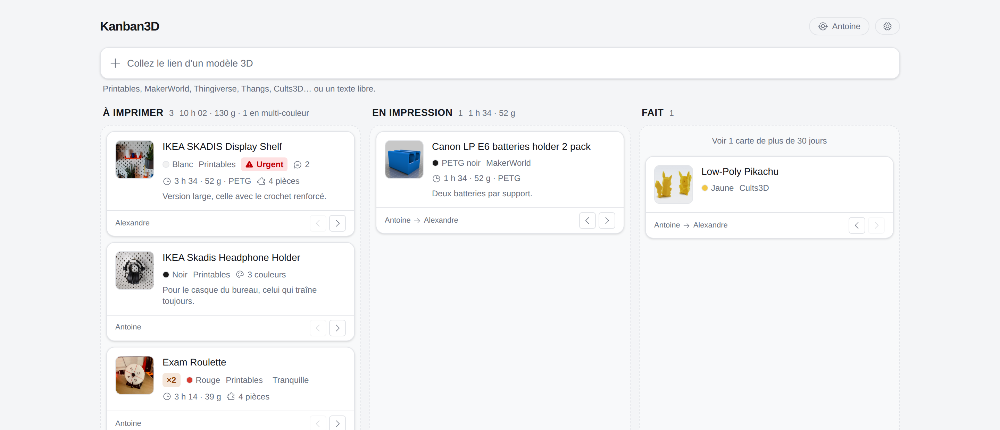

---

## Coller un lien, c'est tout

Un champ, en haut. Vous collez l'adresse d'un modèle — le geste est fini. Aucun
formulaire, aucun bouton : la carte apparaît immédiatement dans « À imprimer »,
et se remplit une seconde plus tard avec ce que la plateforme veut bien dire.

| Au moment du collage | Une seconde plus tard |
| --- | --- |
| 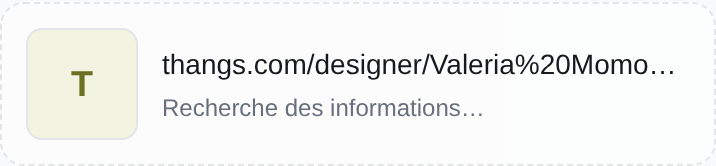 | 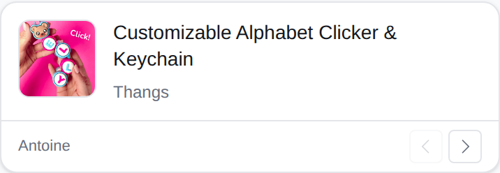 |

C'est **le serveur** qui va chercher titre, image et auteur — un aller-retour
plutôt que deux, et aucune carte ne peut arriver sans nom. Un collage qui
contient plusieurs liens crée plusieurs cartes. Et un texte qui n'est pas un lien
devient simplement le titre, pour une demande sans modèle en ligne.

### Les plateformes reconnues

| | Nom, image, auteur | Durée, filament, matière |
| --- | :---: | :---: |
| **Printables** | ✔ | ✔ |
| **MakerWorld** | ✔ | ✔ |
| **Thingiverse** | ✔ | — |
| **Thangs** — liens `than.gs` compris | ✔ | — |
| **Cults3D** | ✔ | — |
| **MyMiniFactory** | nom et image | — |
| **Creality Cloud**, **Pinshape**, **Fab365** | nom | — |
| n'importe quelle autre adresse | ce que la page veut bien dire | — |

**Rien ne casse jamais.** Une plateforme muette, un lien mort, une page illisible :
la carte se crée quand même, nommée d'après son adresse, et se corrige d'un clic.
Le suffixe du lien n'a aucune importance non plus — `/files`, `/comments`, un
`#fragment` : collez ce que le navigateur affiche, ça marche.

Deux nuances, tant qu'à être honnête : Thingiverse et Thangs refusent de répondre
aux serveurs. Thingiverse s'ouvre avec une clé gratuite ; Thangs, non — ses cartes
arrivent donc correctement nommées, mais sans vignette ni auteur.

---

## Ce que l'impression va coûter

Durée, filament, matière, nombre de pièces et de fichiers. Printables et
MakerWorld publient ces valeurs — la carte les résume en une ligne, sous le titre :

> 🕐 **3 h 14 · 39 g · PETG**  🧩 **4 pièces**

Ailleurs, ou quand l'auteur du modèle ne les a pas renseignées, les champs
restent vides et se remplissent à la main : c'est celui qui a l'imprimante qui a
le dernier mot, après un passage au trancheur.

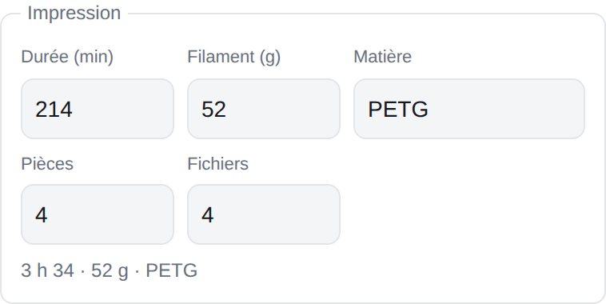

Le récapitulatif suit la saisie : on tape `214`, on lit `3 h 34`.

### Et ce que ça coûte

Donnez le prix de votre kilo de filament, et chaque carte chiffre son impression :

> 🕐 **3 h 14 · 39 g · ~0,97 €**

Chaque colonne affiche son total, quantités comprises — de quoi savoir, avant de
lancer quoi que ce soit, si la file représente une soirée ou un week-end :

> **À IMPRIMER** 3 · 10 h 02 · 130 g · ~3,24 €

Tant que ce prix n'est pas donné, aucun montant n'apparaît nulle part : mieux vaut
ne rien dire qu'avancer un chiffre tiré d'une moyenne inventée.

### Le multi-couleur

Une carte peut annoncer qu'elle demande plusieurs couleurs, et combien :

> 🎨 **3 couleurs · Canvas**

L'intérêt est concret : on voit avant de lancer s'il faut monter l'unité
multi-couleur, au lieu de le découvrir au premier changement de filament. Le total
de la colonne le mentionne aussi — « 1 en multi-couleur ».

---

## L'imprimante, en direct sur le tableau

Un bandeau au-dessus des colonnes, quand une imprimante est reliée :

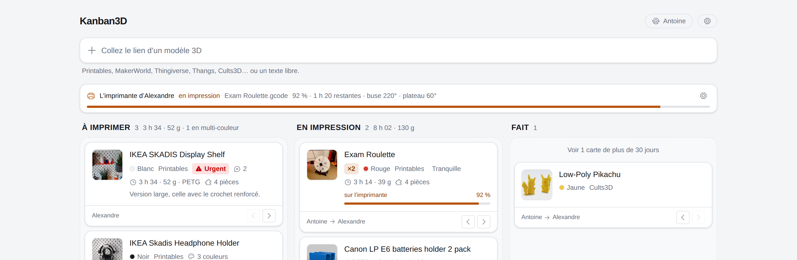

Le nom de la machine, l'état, le fichier en cours, l'avancement, le temps
restant, les températures. Et si le fichier imprimé ressemble au titre d'une
carte, **cette carte affiche aussi sa progression** — « sur l'imprimante 92 % ».
Le tableau ne dit plus seulement ce qui est demandé, il dit où ça en est.

La liaison passe par **OctoEverywhere**, qui sait parler aux imprimantes Elegoo.
Dans OctoEverywhere, on crée un *Live Link* — une adresse en lecture seule — et on
la colle dans les réglages. Rien à ouvrir sur le réseau, rien à installer, et le
lien se révoque du même endroit.

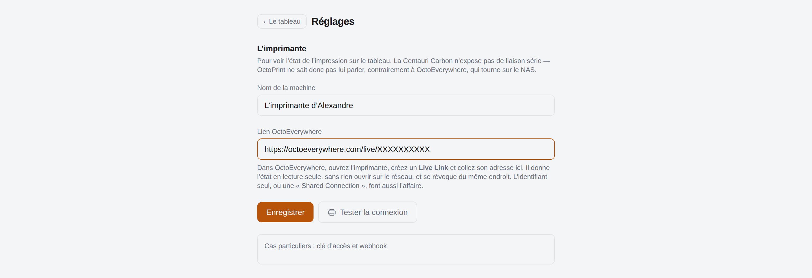

Un bouton « Tester la connexion » dit franchement ce qu'il obtient — l'état lu, ou
l'erreur mot pour mot. Machine éteinte ou NAS débranché, le bandeau garde le
dernier état connu et affiche son âge plutôt qu'un écran vide.

Sans imprimante configurée, il n'y a pas de bandeau : l'application marche
exactement comme avant.

---

## La photo de ce qui est sorti

Le seul moment que le tableau ne montrait pas. Sur la carte terminée, une photo
prise au téléphone remplace l'image du modèle — la colonne « Fait » cesse d'être
une liste et devient une étagère.

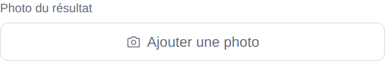

Sur mobile, le bouton ouvre directement l'appareil photo : la pièce dans la main,
deux touches, c'est envoyé. L'image est allégée avant de partir — une photo de
4 Mo passe à 60 ko, ce qui compte quand on est au fond du garage au bout du wifi —
et ses métadonnées sont effacées au passage, position GPS comprise.

---

## Un panneau, pas une fenêtre modale

Cliquez une carte : le détail s'ouvre **à côté** du tableau, qui reste visible et
continue de se rafraîchir. Rien n'est bloqué — on peut déplacer une autre carte
pendant qu'on écrit. La carte concernée est cerclée, sans quoi on ne saurait pas
de laquelle le panneau parle.

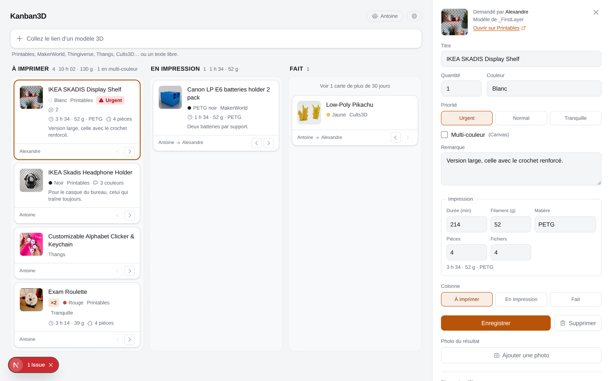

Priorité, quantité, couleur, multi-couleur, remarque, colonne, suppression : tout
est là. Et enregistrer ne referme rien.

---

## Une discussion par carte

Parce que « tu peux le faire en noir plutôt ? » n'a pas sa place dans une
remarque, et encore moins dans une conversation à part.

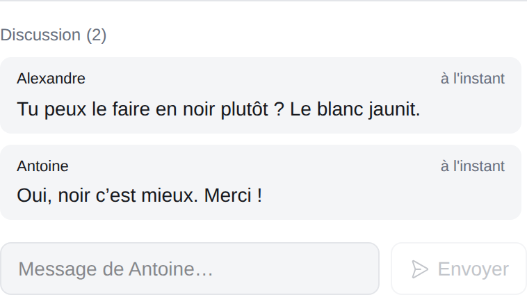

Le nombre de messages s'affiche sur la carte, pour qu'on sache qu'il y a quelque
chose à lire sans ouvrir.

---

## Faire avancer une carte

Au glisser-déposer, ou avec les deux boutons `‹` `›` en pied de carte — sur
téléphone, le glisser-déposer reste capricieux selon les navigateurs, les boutons
garantissent que ça marche toujours.

Le tableau se rafraîchit tout seul toutes les dix secondes et au retour sur
l'onglet : ce que l'un déplace, l'autre le voit. Et une notification part sur les
téléphones à chaque demande, chaque déplacement et chaque message — Telegram,
ntfy ou n'importe quel webhook.

---

## Ce qui passe d'abord

Trois niveaux, choisis d'un doigt : **Tranquille · Normal · Urgent**. La colonne
« À imprimer » se classe d'elle-même — l'urgent en haut — et le badge n'apparaît
que hors du niveau normal, pour dire quelque chose plutôt que de décorer chaque
carte.

Le glisser-déposer continue de fonctionner à l'intérieur d'un niveau, et faire
monter une carte dans le bloc « Urgent » la rend urgente. Rien ne revient à sa
place sous l'œil.

C'est une date en moins à saisir : la question n'a jamais été « pour quand », mais
« laquelle d'abord ».

Et pour que « Fait » ne devienne pas un mur : au-delà de trente jours, une carte
terminée se replie dans un historique qui ne s'ouvre que si on le demande.

| L'historique replié | Déplié |
| --- | --- |
| 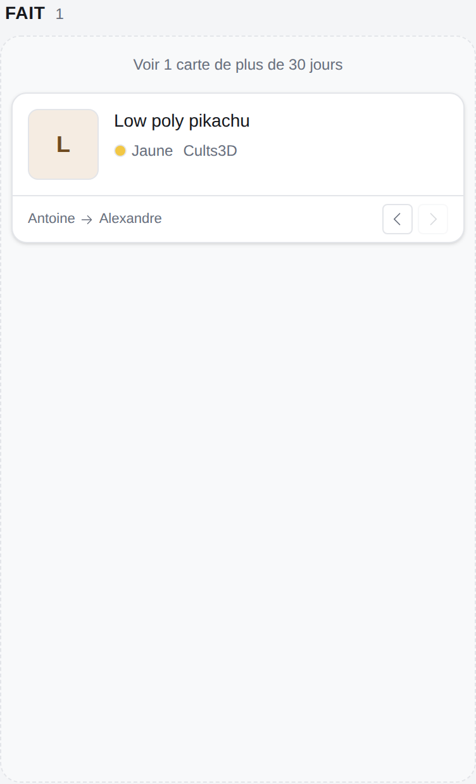 | 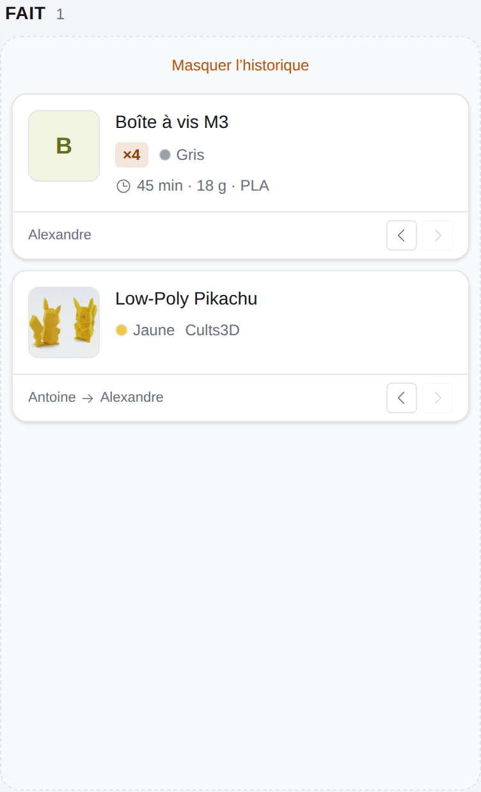 |

---

## Sur téléphone

Les trois colonnes défilent horizontalement, le panneau devient une feuille qui
monte du bas. Installable depuis Safari ou Chrome (« Ajouter à l'écran
d'accueil ») : l'application s'ouvre alors sans barre d'adresse, comme une vraie.

| Le tableau | Le panneau |
| --- | --- |
| 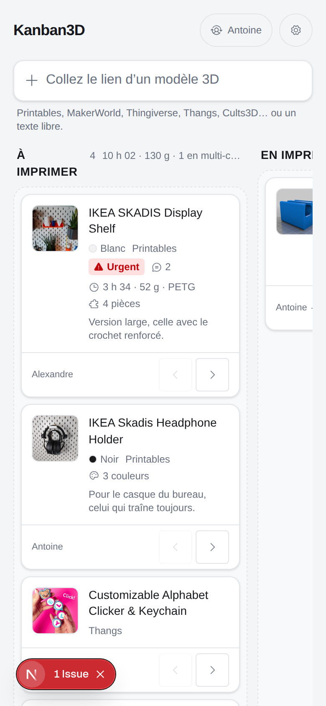 | 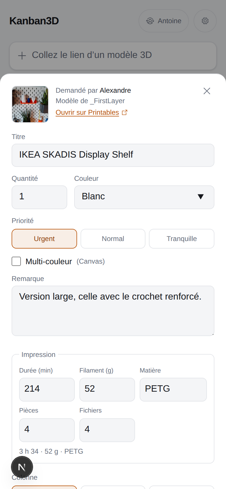 |

---

## Thème sombre, sans réglage

L'application suit le thème du système. Les contrastes sont tenus au niveau AA
dans les deux thèmes, vérifiés au pixel.

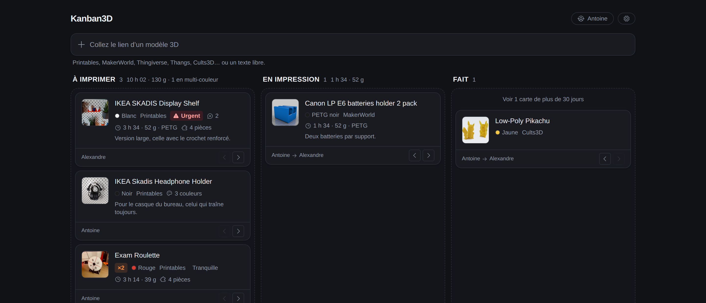

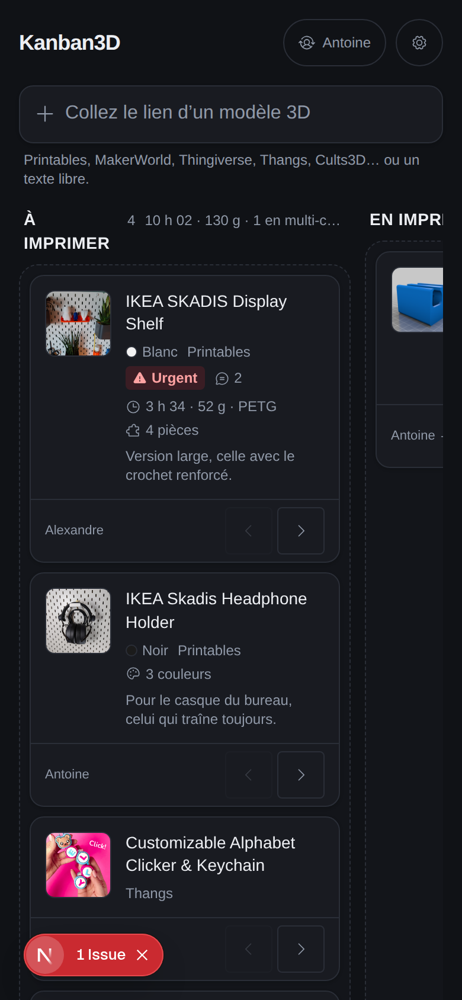

---

## Un code, pas de comptes

Un code partagé à l'entrée, mémorisé un an sur l'appareil. Puis on dit qui on
est — une étiquette, pas une identité : elle sert à écrire « demandé par
Antoine » et se change d'un clic.

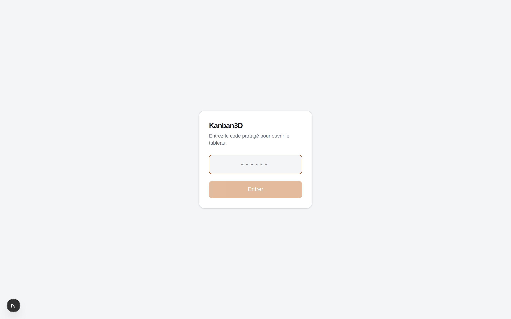

---

---

## Ce que l'application ne fait pas

Volontairement, et il vaut mieux que ce soit écrit noir sur blanc — la moitié du
travail de conception a consisté à dire non :

- **pas de comptes** : un code partagé, et deux prénoms qui ne sont que des
  étiquettes ;
- **pas de collections, pas de tableaux multiples, pas d'étiquettes** : trois
  colonnes, une liste, c'est tout ;
- **pas d'export**, pas de statistiques, pas d'historique détaillé des
  mouvements : on garde « demandé par » et « déplacé par », rien de plus ;
- **pas de téléversement de fichiers STL** : le tableau renvoie vers la
  plateforme, il ne l'héberge pas ;
- **pas de recherche ni de filtre** : utile à deux cents cartes, encombrant à
  vingt. À ajouter le jour où ça manquera vraiment.

Chacun de ces refus est un écran en moins à comprendre. Le cahier des charges
initial disait « sans collection, sans rien » — c'est resté la règle.

---

Le détail technique — architecture, déploiement, choix de conception — est dans
[`docs/technique.md`](docs/technique.md).
